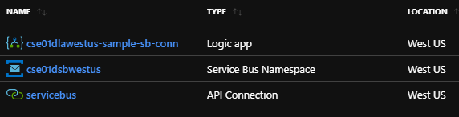
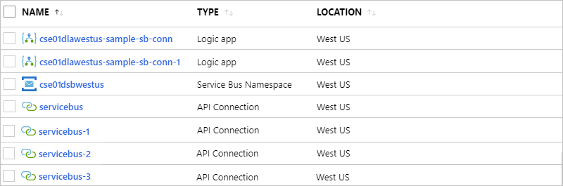
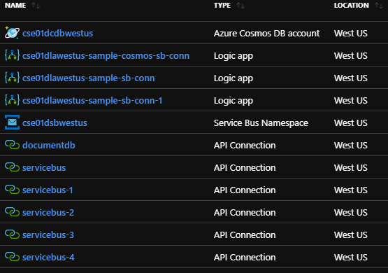
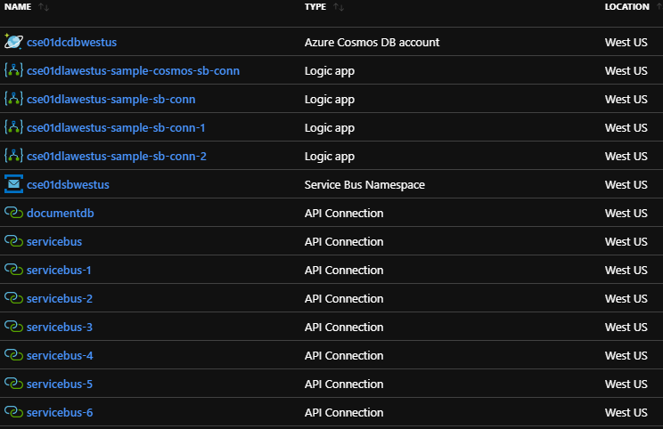
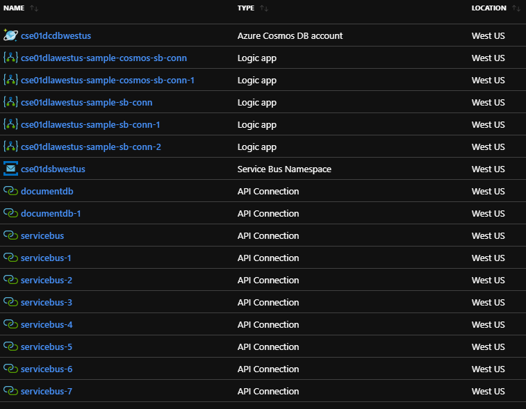
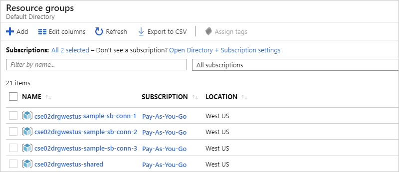

# Why consider scaling?

This topic provides context about the scaling approaches used by the Azure Logic Apps samples for continuous integration (CI) and continuous deployment (CD) pipelines. Logic Apps include built-in scaling, so why create duplicate instances for your logic apps within a single environment?

Some nonnative API connections use built-in throttling, which might prevent your logic apps from reaching the high-scale performance benchmarks that those apps could otherwise achieve. To resolve this scenario, you can create multiple instances for a logic app, which also means creating multiple instances for the API connections used by that logic app.

Now, you could put all those instances in a single resource group. However, having all or a large number of logic apps and API connections in the same group makes some tasks more difficult, for example:

* Troubleshooting logic apps that depend on multiple API connections requires that you know which API connections belong to each logic app. Troubleshooting gets more complicated when you have multiple API connections with the same type.

* Scaling down requires that you cherry pick resources that are all grouped together.

By using a separate resource group for each logic app instance, you get these benefits:

* You gain greater clarity about the API connections that are used by each logic app.

* You make your solution easier to scale up and down.

## How does scaling work?

Suppose you have a logic app that reads messages from one Azure Service Bus queue, runs some tasks, and then posts a message to another Service Bus queue by using a single Service Bus API connection. From a resources perspective, your resource group for these resources looks like this example in the Azure portal:

The Service Bus API connection currently has built-in throttling. So, if you use a single connection to send messages *and* to read messages, *but* you also require high throughput from the logic app, this connection most likely creates a bottleneck. Here are two ways to address this problem by scaling up:

* [Single resource group](#single-group)
* [Multiple resource groups](#multiple-groups)

### Single resource group

These steps describe an approach and the results from trying to fix the bottleneck problem by using a single resource group.

1. You separate the API connections so that one connection reads messages while the other connection sends messages. Your resource group looks like this example:

   

   However, you still get throttling from these connections, and you're nowhere near your throughput requirements.

1. You create another instance for your logic app along with its own API connections, and your resource group now looks like this example:

   

1. Suppose you have to add a different logic app that reads from the second Service Bus queue and runs some tasks that populate an Azure Cosmos database. You don't want to share the API connections from the first logic app because you risk reducing that logic app's throughput.

   So, you create the second logic app, which has its own instances for the Service Bus API connection. Now, your resource group looks like this example:

   

1. As this situation gets more complicated, you discover that the first logic app no longer meets the throughput requirements. You create a third instance for the first logic app, and your resource group looks like this example:

   

1. Now, you find that the same throttling happens on the second logic app. So, you have to create another instance for the second logic app and its connections.

   

So, here are some considerations that result from using a single resource group:

* When did you lose track of which Service Bus API connection belonged to which logic app?

* What happens if you need to continue scaling up both logic apps?

* What happens if you have to remove an instance from either logic app or both? Which connection belongs to which logic app?

* What happens when you have to replicate this solution in multiple environments, such as test, staging, and production *plus* provide instructions to the operations team so that they can support this complexity?

### Multiple resource groups

To make the resources created in the [single resource group approach](#single-group) easier to manage and troubleshoot, you can put the resources for each logic app instance and their API connection dependencies into their own resource groups. This makes it very clear which API connections are used by that logic app. For resources that don't require scaling with logic apps, which are the Service Bus namespace and Azure Cosmos DB account in this example, you can put them in their own "shared" resource group.

Now, the resource group for each logic app instance has the same resources and looks like this example:

The CI/CD samples show how you can scale up by using an `instanceCount` parameter that specifies the number of logic app instances. These samples also explain why scaling up is implemented by keeping a logic app and its API connections in their own resource group. While these samples provide the capability to scale, no scaling is also an acceptable use case. To use a single logic app instance, specify an `instanceCount` of 1.
