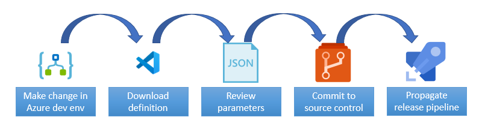
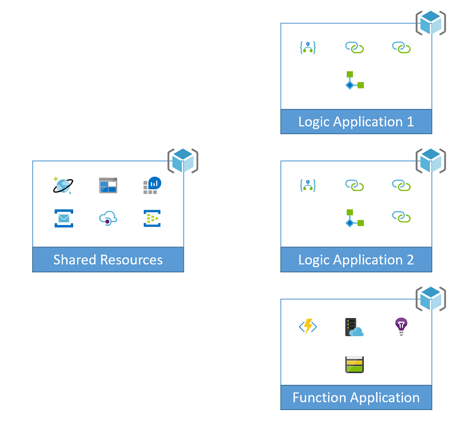
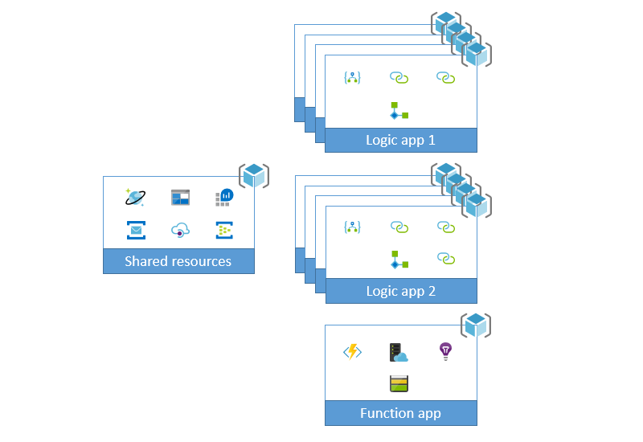
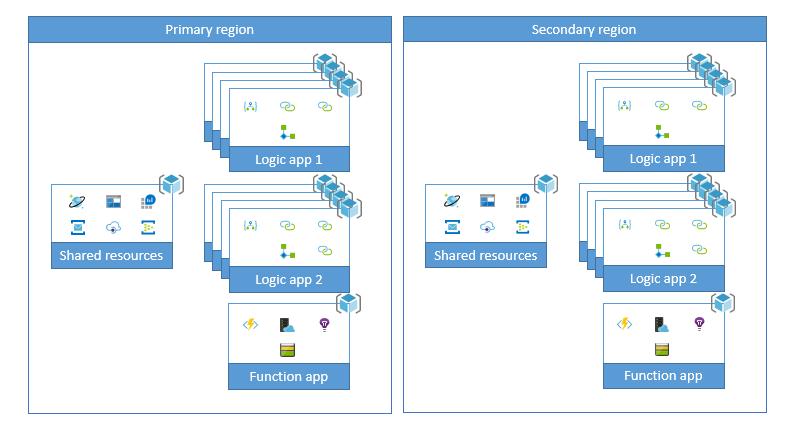
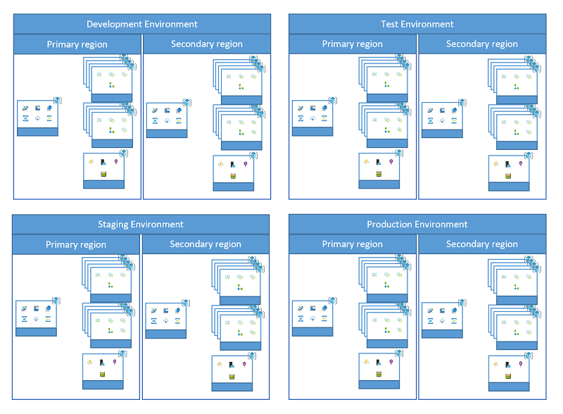

# Deployment Concepts

There are a number of concepts that these samples follow in order to create a deployment pipeline for Microsoft Azure Logic Apps. 

## Developer Workflow

The goal of all of these samples is to be able to streamline both the developer workflow, but also the release pipeline. 

So a typical workflow for a developer would look something like this...

- Developer makes changes in their development environment. Using either VS Code, Visual Studios or the Azure Portal. They run all of the validation steps in that environment and are ready to integrate.
- Developer uses VS Code to download the definition of the logic app
- Developer reviews the definition and the connections in use to ensure any environment specific components have been made dynamic. This could be in the form of parameters passed into the definition, API connections that may need to be added to the connectors template, resources add to the shared template or updates to the ARM template of the Logic app  (see the samples in this repository for examples).
- Developer commits the modified templates to source control.
- Release pipeline automation kicks of in order to propagate the modifications to all of the environments based on the checkpoints that have been implemented. 

## Duplication of resources

A typical enterprise scenario will have the following reasons to duplicate the resources.

- Dev TEAMS: Most enterprise development shops have more than a single developer on the team. This may add the requirement to have separate instances for the different developers. Quite often one developers impact on resources in the environment can slow down or even halt the development efforts of others on the team. Giving these developers their own instances to work on allows them to develop their bits in a silo, then integrate them into the shared environments when the bits are ready to be consumed by others on the team. So each developer will end up having an environment that looks something like this...

- Scaling: See the [Scaling explained](./api-connection-scale.md) document for more of an explanation of this concern. When this scaling is implemented, the resources will end up looking something like this.

- Disaster Recovery (DR): DR will usually involve having a primary and secondary region configured. While some Azure Resources have GEO redundant features built into them, not all do. Those resources will need to be duplicated across multiple regions, usually configured to integrate with that regions other resources. While the production environment will be the only environment that actually requires DR capabilities, the DR resources still need to be developed and tested. Which means a need to have those resources duplicated in every environment. 

- Multiple environments: Most common within an enterprise will be the need for multiple environments. Such as Dev, Test, Staging, Production, etc. 

It is easy to argue the merits of any one of these reasons to duplicate resources. Like your throughput requirements or the API connections won't need the scaling solution, you don't have as many environments, this is a non critical workload so DR is not required. There is rarely a workload that won't tick at least one or two of these needs to duplicate resources. That is why these samples are important. They provide example of how to solve these duplication demands.

## Predictable naming

Due to the duplication of resources we need a means to name our resources that allows them to be unique to the environment, but also identifiable by human beings. A GUID assigned to the resource name will accomplish uniqueness but not human readability. So we need to adhere to a [naming convention](./naming-convention.md) that allows both uniqueness per environment, and human readability.

## Separation of concerns

Each sample has a nearly identical [file structure](./file-definitions.md). This is done not just for consistency, but also to provide separation of concerns. The four separation points are:

- Shared Resources: These are the resources that are used across the solution space. Used by different logic apps, function apps, web applications, etc. They are typically your databases, log analytics work spaces, API Management resources, etc.
- Logic App Specific Resources: Typically your API Connections, these resources are the ones the specific logic app is dependent on. They aren't shared by other logic apps or areas of the solution. They will have the same lifespan as the logic app, and therefore will also reside within the same resource group. 
- Logic App Azure Resource Manager Template: We separate the resource deployment from the definition. We do this for a couple of reasons. 
   - The rate of change on the resource is going to be much slower than the definition.
   - We want to stream line the development process. The definition is the "Application Code" of the logic app, not the  template for the resource.
- Logic App Definition: We stream line the development process by using [VS Code Extension: Azure Logic Apps](https://marketplace.visualstudio.com/items?itemName=ms-azuretools.vscode-logicapps) to pull just the definition from a development environment. Since that is the most frequently modified bit in this pipeline, we want to expedite the changes made here over other modifications. 

The separation of the definition from the template is at the heart of what helps to improve the CI/CD pipeline for Logic Apps. That separation allows the developers to focus on developing the work flow, while reducing the level of effort to deploy these resources across multiple environments. 
