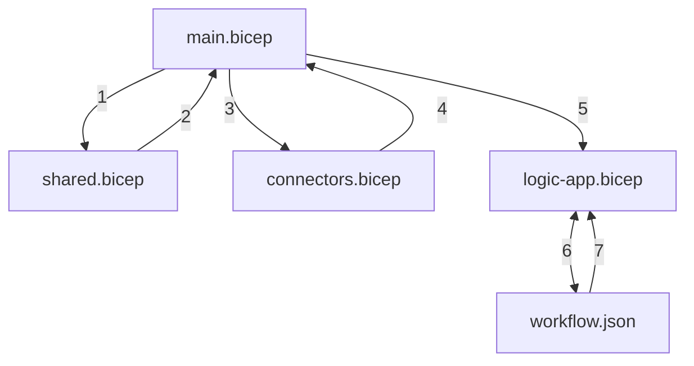

# Samples file structure and definitions

All the samples that create a continuous integration (CI) and continuous delivery (CD) pipeline for Azure Logic Apps follow a similar file structure. Although some minor differences exist, each sample contains the files described in this topic. The files required, and structure of the files differ depending on whether the sample is using ARM Templates or Bicep.

## ARM Templates Based Deployments

The ARM Template based deployments use multiple phases of deployment orchestrated using PowerShell scripts.

### PowerShell scripts

The scripts in each sample follow the workflow that's described by this diagram:

| Script file name | Description |
|------------------|-------------|
| `full-deploy.ps1` | Runs both the `logic-app-deploy.ps1` and `shared-deploy.ps1` scripts for a sample. 
This script is provided for convenience during deployment and isn't meant for use in a CI/CD pipeline. However, the deployments for the shared resources and logic app resource happen inside different CI/CD pipelines. |
| `logic-app-deploy.ps1` | Brings all the logic app pieces together and performs these actions: 
1. Deploy the templates for the API connectors. 
2. Take the output from the connectors deployment and inject the values into both the logic app definition template and logic app definition's parameters file. 
3. Deploy the number of logic app instances that's defined by the input parameters. 
The parameters that pass into this script are also used for naming your logic app resources, based on the [naming convention](./naming-convention.md) used by these samples. |
| `shared-deploy.ps1` | Deploys the `shared-template.json` template and is a variation on the standard PowerShell script that you get when you export from an Azure resource. 
This script differs by using the parameters that pass into the script's execution to construct the parameters that pass into resource deployment. These parameters are used to implement the [naming convention](./naming-convention.md) used throughout these samples. |
| `clean-up.ps1` | Removes all the resources that are deployed by a sample. Examines your subscription, finds all the resource groups that start with the group ID that's passed in, and deletes those groups. 
**Caution**: Proceed carefully when you run this script. |
|||

### Templates

| Template file name | Description |
|--------------------|-------------|
| `connectors-template.json` | This Azure Resource Manager template sets up the resources that deploy to the same resource group as the logic app. 
Generally, these resources include the API connections used by the logic app. This template must provide the outputs that get injected into the `logic-app-definition.json` file and `logic-app-definition-parameters.json` file. |
| `connectors-parameters.json` (optional) | This file contains parameters that deploy with the `connectors-template.json` file. 
- If this file is provided, the parameters that pass in during script execution get appended to the parameters defined in this file. 
- If this file isn't provided, the parameters that pass in during script execution get passed along as a hash table to the connectors template during deployment. |
| `logic-app-definition.json` | This file contains your logic app's workflow definition, or "code". The separation between the logic app's definition file and the Resource Manager template used for deployment is critical to supporting multiple environments. 
These samples are designed to use the [Visual Studio Code extension for Azure Logic Apps](https://marketplace.visualstudio.com/items?itemName=ms-azuretools.vscode-logicapps) so that you can download the logic app's current workflow definition, add that definition to source control, and set up a CI/CD pipeline that deploys to multiple environments. |
| `logic-app-definition-parameters.json` | This file contains parameters that deploy with the `logic-app-definition.json` file. 
**Important**: Make sure that the parameters that are defined in this file are also defined in the `logic-app-definition.json` file. 
The `logic-app-deploy.ps1` script replaces tokens in both the `logic-app-definition.json` file and the `logic-app-definition-parameters.json` file. The replaced tokens are defined by the output from the `connectors-template.json` file. |
| `logic-app-template.json` | This Azure Resource Manager template sets up the logic app but is mostly generic without much content. 
**Note**: Some samples require that the template run one time to succeed. In other words, this template only deploys the first time when the logic app deploys to an environment. When this requirement exists, the `overrideExisting` parameters in the `logic-app-deploy.ps1` script must be set to `false`. |
| `logic-app-template-parameters.json` (optional) | This file contains parameters that deploy with the `logic-app-template.json` file. 
- If this file is provided, the parameters that pass in during script execution get appended to the parameters defined in this file. 
- If this file isn't provided, the parameters that pass in during script execution get passed along as a hash table to the logic app template during deployment. |
| `shared-template.json` | This Azure Resource Manager template sets up the shared resources used by the logic app and deploys those resources to a separate resource group for these reasons: 
- **Separate concerns**: These resources, such as databases, storage accounts, and event hubs, are most likely used by resources other than just the logic app. 
- **Scaling**: These samples provide the capability to scale the logic app's implementations, or more specifically, the API connection implementations. The shared resources in this resource group don't require the scaling capability that other resources require. For more information, see the [Scaling](./api-connection-scale.md) topic. 
- **Lifecycle management**: The lifespan for the shared resources in this resource group likely differ from the logic app. For example, future demands might require that you replace the logic app with an alternative solution. Separate resource groups gives you the flexibility to replace logic apps without having to cherry pick resources from a single resource group that stores all the resources together. 
- **Rate of change**: Usually, the rate of change in shared resources templates is much lower than the rate of change in logic apps. |
| `shared-template-parameters.json` (optional) | This file contains the parameters that deploy with the `shared-template.json` file. 
- If this file is provided, the parameters that pass in during script execution get appended to the parameters defined in this file. 
- If this file isn't provided, the parameters that pass in during script execution get passed along as a hash table to the shared resources template during deployment. |
|||

## Bicep Based Deployments

The Bicep based deployments do not require any PowerShell scripts to perform orchestration of the deployment. Instead the deployment is orchestrated dynamically using Bicep [Modules](https://docs.microsoft.com/en-us/azure/azure-resource-manager/bicep/modules), [outputs](https://docs.microsoft.com/en-us/azure/azure-resource-manager/bicep/outputs?tabs=azure-powershell), and [parameters](https://docs.microsoft.com/en-us/azure/azure-resource-manager/bicep/parameters) to provide the required values to each phase of the deployment.

The Bicep files will generally have the following structure:

| **Step** | **Description** |
|---|---|
| 1 | Deploy the shared resources required by the Logic App |
| 2 | Output the resource names and resource IDs which are required for other module deployments |
| 3 | Deploy the API Connections passing in any other resource names or resource IDs required by the API Connections for successful configuration |
| 4 | Output the API Connection type IDs and Resource IDs |
| 5 | Deploy the Logic App module passing in the API Connection IDs which are required to configure the workflow parameters (`$connections`) |
| 6 | Load the workflow from the JSON file using the `loadTextContent` function (see: [loadTextContent](https://docs.microsoft.com/en-us/azure/azure-resource-manager/bicep/bicep-functions-files#loadtextcontent)) |
| 7 | The JSON text is returned and converted to JSON in the Bicep file to be assigned to the `definition` property. E.g., `definition: json(loadTextContent('workflow.json'))` |

### Templates

| Template file name | Description |
|--------------------|-------------|
| `main.bicep` | This Bicep template is used to orchestrate the end-to-end deployment using the other Bicep templates as modules. It extracts outputs from modules to supply to other modules. Using implicit dependencies ensures the order of deployment is as required. This template takes as few parameters as possible to enable multiple deployments for different environments and regions. |
| `shared.bicep` | This Bicep template sets up the shared resources used by the logic app. In the Bicep samples, the shared resources are deployed to the same resource group as the Logic App and its connections. It is, however, common that shared resources are deployed to a separate resource group to support different access control requirements, scaling, or resource lifecycles. The samples can be modified to support separate resource group deployments by using [Bicep module scopes](https://docs.microsoft.com/en-us/azure/azure-resource-manager/bicep/modules#set-module-scope). 

This template will often output one or more values which are used by `main.bicep` to pass to other modules such as `connectors.bicep` to configure the API Connections. |
| `connectors.bicep` | This Bicep template sets up the API connections which are required by the Logic App Workflow. 
Generally, these resources include the API connections used by the logic app. This template must provide the outputs that get injected into the `logic-app.bicep` file so that the Logic App Workflow resource can be configured with the appropriate parameters expected by the workflow. Generally this will always be a `$connections` parameter, but may include more. |
| `logic-app.bicep` | This Bicep template sets up the logic app resource and the "code" from `workflow.json` which is read dynamically when the template is executed. The outputs from `connectors.bicep` are passed as parameters from `main.bicep` to enable the `$connections` parameter to be populated dynamically without the need for token substitution. |
| `workflow.json` | This file contains your logic app's workflow definition, or "code". The separation between the logic app's definition file and the Bicep template used for deployment is critical to supporting multiple environments. However, the `logic-app.bicep` file will read the `workflow.json` file contents so that the resource and workflow "code" can be deployed in a single step. 
These samples are designed to use the [Visual Studio Code extension for Azure Logic Apps](https://marketplace.visualstudio.com/items?itemName=ms-azuretools.vscode-logicapps) so that you can download the logic app's current workflow definition, add that definition to source control, and set up a CI/CD pipeline that deploys to multiple environments. |
| `workflow.parameters.json` | This file contains the structure of the parameters that are expected by the "code" in the `workflow.json` file. For the Bicep samples, this is used primarily as a reference for the values required, and structure of, the parameters which are required in `logic-app.bicep` 
Unlike the ARM Template Samples, using modules in Bicep allow the outputs from `connectors.bicep` to be dynamically passed to `logic-app.bicep` so that the parameter values can be provided directly instead of using token replacement. |
|||

As with ARM Template deployments, you can also provide a parameters file which is associated with the top-level `main.bicep`. This should account for all the parameters required by the main template with the main template orchestrating the parameters required by the modules. Each module cannot have a separate parameters file.
