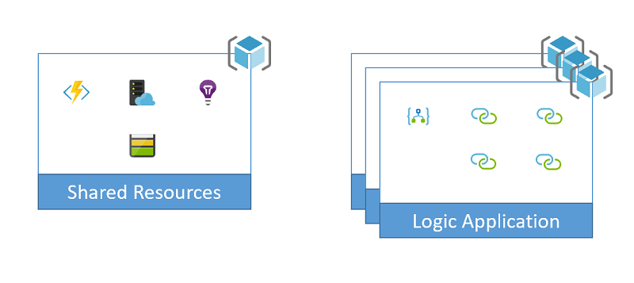

# Set up an Azure function app action for Azure Logic Apps and deploy with Azure DevOps Pipelines

This sample shows how to set up a function app action by creating and deploying a logic app by using Azure DevOps Pipelines. However, this task can pose a challenge because a function app action uses the function app's resource ID, which isn't available until deployment. To learn more about the template and definition files in this sample and how they work, review [Samples file structure and definitions](../file-definitions.md).

## Prerequisites

* Install [Azure PowerShell 2.4.0](https://docs.microsoft.com/powershell/azure/install-az-ps?view=azps-2.4.0) on your platform.
* Install [Azure Functions Core Tools](https://docs.microsoft.com/azure/azure-functions/functions-run-local#v2) on your platform.

## Why is this task tricky? 

The function app action uses the function app's resource ID, which follows this syntax:

```text
"id": "/subscriptions/{subscriptionId}/resourceGroups/{resourceGroupName}/
      providers/Microsoft.Web/sites/{functionAppName}/functions/{functionName}"
```

To get the function app's resource ID, you can use an Azure Resource Manager template function as shown in this [example for referencing dependent resources](https://docs.microsoft.com/azure/logic-apps/logic-apps-create-deploy-template#reference-dependent-resources). However, this technique requires that the logic app definition appear inside the Resource Manager template. The act of deploying the template allows the template function to evaluate and replace the values in the definition. So, each time that you update the definition, not only must you incorporate deployment with the template, you must also update the definition outside of the Logic App Designer to complete this task. Ideally, you want to minimize any manual intervention between exporting the definition from Azure and committing that definition to your source code repository.

To show why this task is tricky, here's an approach that ultimately doesn't work because the function app action tries to read the function app's keys before parameters can get evaluated at deployment. This solution tries to pass the `subscriptionId`, `resourceGroupName`, and `functionAppName` values as variables, which we define as outputs in the `connectors-template.json` file so that we then use these values in the `logic-app-definition-parameters.json` file. For example, the `connectors-template.json` file defines these output variables:

```json
<other-template-sections>,
"outputs": {
   "functionAppName": {
      "type": "string",
      "value": "[variables('functionAppName')]"
   },
   "functionAppResourceGroup": {
      "type": "string",
      "value": "[variables('sharedResourceGroupName')]"
   },
   "subscriptionId": {
     "type": "string",
     "value": "[subscription().subscriptionId]"
   },
   "logicAppName": {
      "type": "string",
      "value": "[variables('logicAppName')]"
   }
}
```

And the `logic-app-definition-parameters.json` file uses these outputs:

```json
<other-definition-parameters>,
"$azureResourceManagerValues": {
   "value": {
      "functionAppName": "{functionAppName}",
      "functionAppResourceGroup": "{functionAppResourceGroup}",
      "subscriptionId": "{subscriptionId}"
   }
}
```

So now, we should be able to define the resource ID by using this syntax:

```json
"id": "/subscriptions/@parameters('$azureResourceManagerValues')['subscriptionId']/
   resourceGroups/@parameters('$azureResourceManagerValues')['functionAppResourceGroup']/
   providers/Microsoft.Web/sites/@parameters('$azureResourceManagerValues')['functionAppName']/functions/AwesomeFunction"
```

However, a function app action doesn't require that you manage and pass around the keys for a function. So, when we update the logic app definition by using the function ID, the action tries to read the keys for the function app. The action doesn't wait until deployment when parameters get evaluated, but uses the raw values that are passed as inputs. As a result, we get an error such as `"the linked subscription '@parameters('$azureResourceManagerValues')['subscriptionId']' was not found."` Here's the expanded error message:

```text
Set-AzResource : LinkedAuthorizationFailed : The client has permission to perform action 'Microsoft.Web/
   sites/functions/listSecrets/action' on scope '/subscriptions/**********/resourceGroups/**********/
   providers/Microsoft.Logic/workflows/********', however the linked subscription 
   '@parameters('$armValues')['subscriptionId']' was not found.

At C:\source\arming-logic-apps\FunctionAppActions\powershell\logic-app-deploy.ps1:435 char:25
+   $logicAppResource | Set-AzResource -Force;
+                   ~~~~~~~~~~~~~~~~~~~~~~~~~~
   + CategoryInfo : CloseError: (:) [Set-AzResource], ErrorResponseMessageException
   + FullyQualifiedErrorId : LinkedAuthorizationFailed,Microsoft.Azure.Commands.ResourceManager.
     Cmdlets.Implementation.SetAzureResourceCmdlet
```

To successfully deploy the logic app definition, this value must be already set to the function app's resource ID. So, we can't avoid having to manually update the definition so that parameter values are dynamic between environments. However, at the very least, you can separate the definition and the template by changing how you inject values. To let our scripts replace token values before deploying to Azure, change the `id` value to this syntax instead:

```json
"id": "/subscriptions/{subscriptionId}/resourceGroups/{functionAppResourceGroup}/
   providers/Microsoft.Web/sites/{functionAppName}/functions/AwesomeFunction"
```

## Set up sample

To set up, deploy, and run this sample, you can use the command line or set up an Azure DevOps pipeline.

### Command line

1. Clone or download this sample repository.

1. Sign in to Azure by running this command from any command line tool that you want.

   ```powershell
   Connect-AzAccount
   ```

1. To target your deployment, select the appropriate [Azure context](https://docs.microsoft.com/powershell/module/az.accounts/Select-AzContext?view=azps-2.4.0) to use.

1. To push a full deployment for this sample to Azure, run this command from the PowerShell directory that contains this sample:

   ```powershell
   ./full-deploy.ps1 -groupId <groupId> -environment <environment> -location <regionName>
   ```

### Azure DevOps

This sample uses [multi-stage YAML pipelines](https://docs.microsoft.com/azure/devops/pipelines/process/stages?view=azure-devops&tabs=yaml). To set up the sample pipeline, follow these steps:

1. Make sure that the [multi-stage pipeline preview feature](https://docs.microsoft.com/azure/devops/project/navigation/preview-features?view=azure-devops) is enabled.

1. Clone or fork the samples repository into your own repository.

1. Choose one of these steps:

   * Create an [Azure Resource Manager service connection](https://docs.microsoft.com/azure/devops/pipelines/library/service-endpoints?view=azure-devops&tabs=yaml#sep-azure-rm) that has the name "Azure Samples Subscription" in your project that points to the Azure subscription that you want to use for deployment.

   * Edit all instances of `azureSubscription: 'Azure Samples Subscription'` in the `./powershell/azure-pipelines.yml` file by using the name for an existing Azure Resource Manager service connection in your project.

   > [!NOTE]
   > To use the Azure Resource Manager service connection, make sure that the connection has selected the **Allow all pipelines to use this connection** checkbox. Otherwise, you must authorize the pipeline that you create in the next step.

1. Update these `./pipeline/azure-pipelines.yml` variables:

   * `groupId`: A value that's unique to you or your organization and is used to start the names for all resources and resource groups that are created

   * `location`: The name for the Azure region where you want to deploy the resources

   * `abbrevLocationName`: The abbreviated region name that's used in resource names

1. Create a new pipeline in your project that uses the `./powershell/azure-pipelines.yml` file from this sample.

   

## Supporting documentation

To learn more about the different parts in these samples, review these topics:

* [Concepts](../concept-review.md) introduces the main concepts that underlie these samples.

* [Naming convention](../naming-convention.md) describes the naming convention to use when creating the resources in these samples.

* [Samples file structure and definitions](../file-definitions.md) explains the purpose for each file in these samples.

* [Scaling](../api-connection-scale.md) expands on the reasons why these samples provide the capability to scale by increasing the number of copies for the logic apps deployed and organizing resources into separate resource groups.

## Created resources

This sample creates these resources:



To learn about the scripts in this sample and how they work, review [Samples file structure and definitions](../file-definitions.md).

This sample also implements these template and definition files:

| File name | Description |
|-----------|-------------|
| `shared-template.json` | This template deploys the Azure function app and all its dependent resources. <p>The `full-deploy.ps1` script not only creates Azure resources for the function app but can publish that app's source from `./sample=function`. You must publish the app first before the logic app definition can work. To run this script, you must have the Azure Function CLI installed on your computer. Remember that the `full-deploy.ps1` script is used for local execution from a development computer. The idea behind this deployment is that the function app's code gets its own CI/CD pipeline. |
| `connectors-template.json` | This template provides the parameters to inject into the logic app definition but doesn't actually deploy anything. This approach is consistent with the method for injecting parameters into a logic app across the other samples. |
| `logic-app-template.json` | This template creates a shell for a logic app definition, which is blank to support separating the template from the definition. |
| `logic-app-definition.json` | This file defines a basic logic app that uses a timer as a trigger and calls the provided `AwesomeFunction` each time that the logic app gets triggered. |
|||

## Clean up

When you're done with the sample, delete the resource groups that were created by the sample. To remove all the resource groups with names that start with a specific `groupId` value, run this command from the PowerShell directory that contains this sample:

```powershell
./clean-up.ps1 -groupId <groupId>
```
