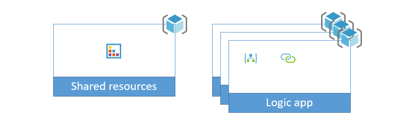

# Connect to an integration account from Azure Logic Apps and deploy by using Azure DevOps Pipelines

This sample shows how to create a logic app that handles X12 messages by connecting to an integration account and deploy the app by using Azure DevOps Pipelines. 

In this topic, you complete the following tasks:

* Set up the logic app with a connection to an integration account, which is used by most of the integration account's related actions.

* Set up an X12 API connection, which is used by all the X12-related actions to work with the integration account.

To learn more about the template and definition files in this sample and how they work, review [Samples file structure and definitions](../file-definitions.md).

## How this sample works

This sample uses the outputs from creating the X12 connection and defines these output variables in the `connectors-template.json` file:

```json
"outputs": {
   "x12ManagedApiId": {
      "type": "string",
      "value": "[variables('x12ConnectionId')]"
   },
   "x12ConnId": {
      "type": "string",
      "value": "[resourceId('Microsoft.Web/connections', variables('x12ConnectionName'))]"
   },
   "logicAppName": {
      "type": "string",
      "value": "[variables('logicAppName')]"
   }
}
```

The `logic-app-definition-parameters.json` file replaces the `x12ConnId` and `x12ManagedApiId` values and updates the logic app's definition with the resulting values:

```json
{
   "$connections": {
      "value": {
         "x12": {
            "connectionId": "{x12ConnId}",
            "connectionName": "x12",
            "id": "{x12ManagedApiId}"
         }
      }
   }
}
```

In the `logic-app-template` file, the following code sets up the logic app to use the integration account that's defined in the `shared-template. json` file:

``` json
"integrationAccount": {
  "id": "[resourceId(subscription().subscriptionId, variables('sharedResourceGroupName'), 'Microsoft.Logic/integrationAccounts', variables('integrationAccountName'))]"
}
```

## Prerequisites

* Install [Azure PowerShell 2.4.0](https://docs.microsoft.com/powershell/azure/install-az-ps?view=azps-2.4.0) on your platform.

## Set up sample

To set up, deploy, and run this sample, you can use the command line or set up an Azure DevOps pipeline.

### Command line

To run this sample from the command line, follow these steps.

1. Clone or download this sample repository.

1. Sign in to Azure by running this command from any command line tool that you want.

   ```powershell
   Connect-AzAccount
   ```

1. To target your deployment, select the appropriate [Azure context](https://docs.microsoft.com/powershell/module/az.accounts/Select-AzContext?view=azps-2.4.0) to use.

1. To push a full deployment for this sample to Azure, run this command from the PowerShell directory that contains this sample:

   ```powershell
   ./full-deploy.ps1 -groupId <groupId> -environment <environment> -location <regionName>
   ```

### Azure DevOps

This sample uses [multi-stage YAML pipelines](https://docs.microsoft.com/azure/devops/pipelines/process/stages?view=azure-devops&tabs=yaml). To set up the sample pipeline, follow these steps:

1. Make sure that the [multi-stage pipeline preview feature](https://docs.microsoft.com/azure/devops/project/navigation/preview-features?view=azure-devops) is enabled.

1. Clone or fork the samples repository into your own repository.

1. Choose one of these steps:

   * Create an [Azure Resource Manager service connection](https://docs.microsoft.com/azure/devops/pipelines/library/service-endpoints?view=azure-devops&tabs=yaml#sep-azure-rm) that has the name "Azure Samples Subscription" in your project that points to the Azure subscription that you want to use for deployment.

   * Edit all instances of `azureSubscription: 'Azure Samples Subscription'` in the `./powershell/azure-pipelines.yml` file by using the name for an existing Azure Resource Manager service connection in your project.

   > [!NOTE]
   > To use the Azure Resource Manager service connection, make sure that the connection has selected the **Allow all pipelines to use this connection** checkbox. Otherwise, you must authorize the pipeline that you create in the next step.

1. Update these `./pipeline/azure-pipelines.yml` variables:

   * `groupId`: A value that's unique to you or your organization and is used to start the names for all resources and resource groups that are created

   * `location`: The name for the Azure region where you want to deploy the resources

   * `abbrevLocationName`: The abbreviated region name that's used in resource names

1. Create a new pipeline in your project that uses the `./powershell/azure-pipelines.yml` file from this sample.

   

## Supporting documentation

To learn more about the different parts in these samples, review these topics:

* [Concepts](../concept-review.md) introduces the main concepts that underlie these samples.

* [Naming convention](../naming-convention.md) describes the naming convention to use when creating the resources in these samples.

* [Samples file structure and definitions](../file-definitions.md) explains the purpose for each file in these samples.

* [Scaling](../api-connection-scale.md) expands on the reasons why these samples provide the capability to scale by increasing the number of copies for the logic apps deployed and organizing resources into separate resource groups.

## Resources

This sample creates these resources:



To learn about the scripts in this sample and how they work, review [Samples file structure and definitions](../file-definitions.md).

This sample also implements these template and definition files:

| File name | Description |
|-----------|-------------|
| `shared-template.json` | This template creates and deploys an integration account. |
| `connectors-template.json` | This template creates an X12 API connection to the integration account that's created by the `shared-template.json` file. |
| `logic-app-template.json` | This template creates a shell for a logic app definition, which is blank to support separating the template from the definition. The logic app's integration account property is set up to point at the integration account that's created by the `shared-template.json` file. |
| `logic-app-definition.json` | This file in this sample is blank. Any sample that's created for an integration account requires uploading and setting up the integration account with partners, agreements, schemas, and maps. This task is outside the scope for this specific sample. |
|||

## Clean up

When you're done with the sample, delete the resource groups that were created by the sample. To remove all the resource groups with names that start with a specific `groupId` value, run this command from the PowerShell directory that contains this sample:

```powershell
./clean-up.ps1 -groupId <groupId>
```
