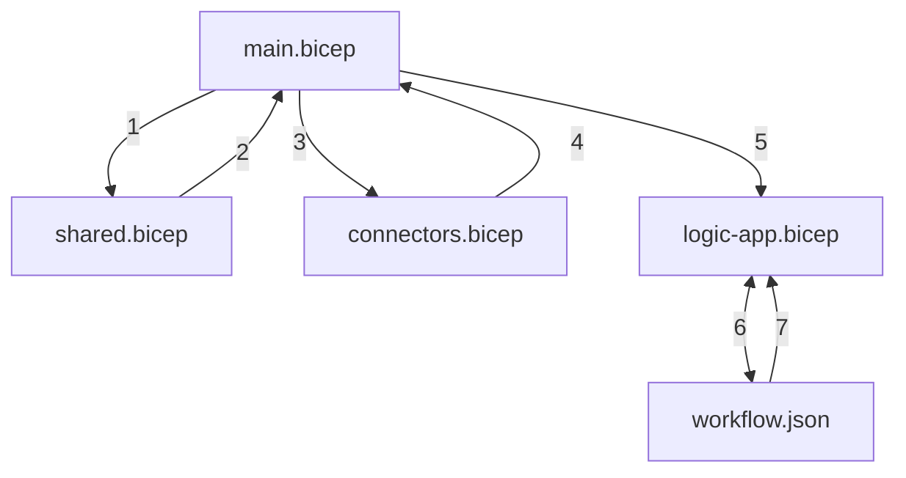
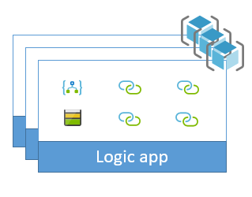

# Connect to Azure Storage accounts from Azure Logic Apps and deploy with Azure DevOps Pipelines

This sample shows how to create a logic app that connects to different Azure Storage containers (Blob, Table, Queue, and File) using [Bicep](https://docs.microsoft.com/en-us/azure/azure-resource-manager/bicep/overview?tabs=bicep) and deploy the app by using Azure DevOps Pipelines. The logic app definition isn't complex, so the goal for this sample focuses on how to create these connections for use by the logic app definition. To learn more about the template and definition files in this sample and how they work, review [Samples file structure and definitions](../../file-definitions.md#bicep-based-deployments).

## How this sample works

Unlike the [ARM Templates](../ARM-Templates/) sample, the deployment using Bicep is self-contained and can be performed in a single step. This simplifies the deployment process with the added advantage of the improved readability, modularization, and features of the Bicep language. The way this is achieved is by using [Bicep Modules](https://docs.microsoft.com/en-us/azure/azure-resource-manager/bicep/modules) and [loadTextContent(filePath, [encoding])](https://docs.microsoft.com/en-us/azure/azure-resource-manager/bicep/bicep-functions-files#loadtextcontent) function. One of the additional differences in this sample compared to the ARM Templates version is that the resources are deployed to a single resource group. If resources should be deployed to separate resource groups, the `main.bicep` file can be scoped to the subscription level, and each module can be scoped to a resource group. For more information on deployment scopes, see [Scopes in Bicep](https://docs.microsoft.com/en-us/azure/azure-resource-manager/bicep/modules#set-module-scope).

The Bicep files have the following structure:



| **Step** | **Description** |
|---|---|
| 1 | Deploy the storage account resource |
| 2 | Output the storage account name and Resource ID |
| 3 | Deploy the API Connections passing in the storage account name and Resource ID |
| 4 | Output the API Connection type IDs and Resource IDs |
| 5 | Deploy the Logic App passing in the API Connection IDs which are required to configure the workflow parameters |
| 6 | Load the workflow from the JSON file |
| 7 | The JSON text is returned and converted to JSON in the Bicep file |

This sample uses the outputs from creating Azure Storage connections and defines these output values in the [connectors.bicep](./templates/connectors.bicep) file:

``` bicep
output tablesManagedApiId string = tablesConnectionId
output tablesConnId string = tablesConnection.id
output fileManagedApiId string = fileConnectionId
output fileConnId string = fileConnection.id
output blobManagedApiId string = blobConnectionId
output blobConnId string = blobConnection.id
output queuesManagedApiId string = queuesConnectionId
output queuesConnId string = queuesConnection.id
```

The [main.bicep](./templates/main.bicep) file uses these outputs and passes them to the [logic-app.bicep](./templates/logic-app.bicep) file as parameters. The values are then used to configure the parameter values to pass to the Logic App module for deployment:

`main.bicep`

``` bicep
module logicApp 'logic-app.bicep' = {
  name: '${deployment().name}-logic-app-deploy'
  params: {
    workflowNamePrefix: appNamePrefix
    environment: environment
    location: location
    tablesConnId: connectors.outputs.tablesConnId
    tablesManagedApiId: connectors.outputs.tablesManagedApiId
    blobConnId: connectors.outputs.blobConnId
    blobManagedApiId: connectors.outputs.blobManagedApiId
    queuesConnId: connectors.outputs.queuesConnId
    queuesManagedApiId: connectors.outputs.queuesManagedApiId
    fileConnId: connectors.outputs.fileConnId
    fileManagedApiId: connectors.outputs.fileManagedApiId
  }
}
```

The parameters are then used to define the values in the `$connections` parameter for the Logic App resource in `logic-app.bicep`.

`logic-app.bicep`

``` bicep
'$connections': {
  value: {
    azuretables: {
      connectionId: tablesConnId
      connectionName: 'azuretables'
      id: tablesManagedApiId
    }
    azureblob: {
      connectionId: blobConnId
      connectionName: 'azureblob'
      id: blobManagedApiId
    }
    azurefile: {
      connectionId: fileConnId
      connectionName: 'azurefile'
      id: fileManagedApiId
    }
    azurequeues: {
      connectionId: queuesConnId
      connectionName: 'azurequeues'
      id: queuesManagedApiId
    }
  }
}
```

> **Note:** The sample also includes a `workflow.parameters.json` file. This is not used directly, but is useful when extracting the Logic App in VS Code to use as a guide when defining the `$connections` parameter in `logic-app.bicep`. Wiring the parameters up in the Bicep file removes the requirement to perform token substitution using PowerShell which is how it is used in the [ARM Template](../ARM-Templates/) sample.
>
> [!IMPORTANT]
>
> Pay specific attention to the different `parameterValues` sections in each storage connection. Some differences exist in how these managed APIs are defined, which often causes some confusion. Both the `azureblob` and `azurefile` APIs want `accountname` and `accesskey` values, while the `azurequeues` and `azuretables` APIs want `storageaccount` and `sharedkey` values.

## Prerequisites

* Install the latest version of the [Bicep tools](https://docs.microsoft.com/en-us/azure/azure-resource-manager/bicep/install) on your platform.
* Install the latest version of [Azure PowerShell](https://docs.microsoft.com/en-us/powershell/azure/install-az-ps?view=azps-7.5.0) or;
* Install the latest version of the [Azure CLI](https://docs.microsoft.com/en-us/cli/azure/install-azure-cli)
* **Optional** If you would like to explore the sample using VS Code, it is recommended that you install the [Bicep Extension](https://docs.microsoft.com/en-us/azure/azure-resource-manager/bicep/install#vs-code-and-bicep-extension). This will provide linting, intellisense, and code navigation features.

## Set up sample

To set up, deploy, and run this sample, you can use the command line or set up an Azure DevOps pipeline.

### Command line

To run this sample from the command line, follow these steps. You can use the Azure CLI or Azure PowerShell.

1. Clone or download this sample repository.

1. Sign in to Azure by running this command from any command line tool that you want.

   ```powershell
   Connect-AzAccount
   ```

   or

   ```azurecli
   az login
   ```

1. To target your deployment, select the appropriate subsription using:
   1. [Select-AzContext (PowerShell)](https://docs.microsoft.com/powershell/module/az.accounts/Select-AzContext?view=azps-2.4.0) or;
   1. [az account set (Azure CLI)](https://docs.microsoft.com/en-us/cli/azure/account?view=azure-cli-latest#az-account-set)

1. Create a new resource group for the deployment.

   ```powershell
   New-AzResourceGroup -Name <resource-group-name> -Location <location>
   ```

   or

   ```azurecli
   az group create  --name <resource-group-name> --location <location>
   ```

1. To push a full deployment for this sample to Azure, run this command from the PowerShell directory that contains this sample:

   ```powershell
   New-AzResourceGroupDeployment -ResourceGroupName <resource-group-name> -appNamePrefix <short-app-name-prefix> [-environment <environment>] [-location <region-name>]
   ```

   or

   ```azurecli
   az deployment group create --resource-group <resource-group-name> --template-file main.bicep  --parameters appNamePrefix='<short-app-name-prefix>' [environment='<environment>'] [location='<region-name>']
   ```

   Where parameters in [square brackets] are optional.

   `environment` supports the following values:
      * `d` - Development Environment (Default)
      * `t` - Test Environment
      * `s` - Staging Environment
      * `p` - Production Environment  

   `location` supports any [Azure Region](https://docs.microsoft.com/en-us/azure/availability-zones/az-overview#azure-regions-with-availability-zones) with the space removed. The location is also used to include a region abbreviation in resource names which is dynamically determined at runtime. The sample includes the following regions and abbreviations
      * `uksouth`: `uks`
      * `ukwest`: `ukw`
      * `northeurope`: `neu`
      * `westeurope`: `weu`
      * `westus`: `wus`
      * `eastus`: `eus`  
   The default is the resource group location.

   To deploy to a different region, update the `locationAbbr` variable to include the region in [shared.bicep](./templates/shared.bicep), [connectors.bicep](./templates/connectors.bicep), and [logic-app.bicep](./templates/logic-app.bicep).

### Azure DevOps

This sample uses [multi-stage YAML pipelines](https://docs.microsoft.com/azure/devops/pipelines/process/stages?view=azure-devops&tabs=yaml). To set up the sample pipeline, follow these steps:

1. Clone or fork the samples repository into your own repository.

1. Choose one of these steps:

   * Create an [Azure Resource Manager service connection](https://docs.microsoft.com/en-us/azure/devops/pipelines/library/service-endpoints?view=azure-devops&tabs=yaml#create-a-service-connection) that has the name "Azure Samples Subscription" in your project that points to the Azure subscription that you want to use for deployment.

   * Edit all instances of `azureSubscription: 'Azure Samples Subscription'` in the [azure-pipelines/azure-pipelines.yml](./azure-pipelines/azure-pipelines.yml) file by using the name for an existing Azure Resource Manager service connection in your project.

   > [!NOTE]
   > To use the Azure Resource Manager service connection, make sure that the connection has selected the **Allow all pipelines to use this connection** checkbox. Otherwise, you must authorize the pipeline that you create in the next step.

1. Update these [azure-pipelines/azure-pipelines.yml](./azure-pipelines/azure-pipelines.yml) variables:

   * `resourceGroupPrefix`: A value that's unique to you or your organization and is used to start the name for the resource group that is created. The resource group will be created automatically if it doesn't exist.

   * `location`: The name for the Azure region where you want to deploy the resources (remember to update the Bicep files as indicated above if you are deploying to a different region than those listed)

1. Create a new pipeline in your project that uses the [azure-pipelines/azure-pipelines.yml](./azure-pipelines/azure-pipelines.yml#bicep-based-deployments) file from this sample.

   

## Supporting documentation

To learn more about the different parts in these samples, review these topics:

* [Concepts](../../concept-review.md) introduces the main concepts that underlie these samples.

* [Naming convention](../../naming-convention.md) describes the naming convention to use when creating the resources in these samples.

* [Samples file structure and definitions](../../file-definitions.md#bicep-based-deployments) explains the purpose for each file in these samples.

* [Scaling](../../api-connection-scale.md) expands on the reasons why these samples provide the capability to scale by increasing the number of copies for the logic apps deployed and organizing resources into separate resource groups.

## Resources

This sample creates these resources:



To learn about the scripts in this sample and how they work, review [Samples file structure and definitions](../../file-definitions.md#bicep-based-deployments).

This sample also implements these template and definition files:

| File name | Description |
|-----------|-------------|
| [shared.bicep](./templates/shared.bicep) | This template creates a single storage account resource that has two blob containers, two storage queues, two file shares, and two storage tables. |
| [connectors.bicep](./templates/connectors.bicep) | This template creates an API connection resource for Azure Tables, Files, Blobs, and Queues and outputs the values required for the workflow paramters. |
| [logic-app.bicep](./templates/logic-app.bicep) | This template creates the Logic App Workflow resource and deploys the workflow by reading the workflow.json file dynamically. |
| [workflow.json](./templates/workflow.json) | This file defines a basic logic app workflow that gets a message from `samplequeue1`, creates a blob file from the message content, writes an entity into the storage table, and creates a file in the file share. |
| [workflow.parameters.json](./templates/workflow.parameters.json) | This file contains the structure required for the `$connections` parameter to be passed to the Logic App Workflow resource. This is not used by the sample directly, but can be used as a reference for the structure and required values of the parameter. |
| [bicepconfig.json](./templates/bicepconfig.json) | This file contains configuration for how the Bicep tools will behave when working in VS Code and deploying using the CLI tools. |
|||

## Clean up

When you're done with the sample, delete the resource groups that were created by the sample:

```powershell
Remove-AzResourceGroup -Name <resource-group-name>
```

or

```azurecli
az group delete --resource-group <resource-group-name>
```
