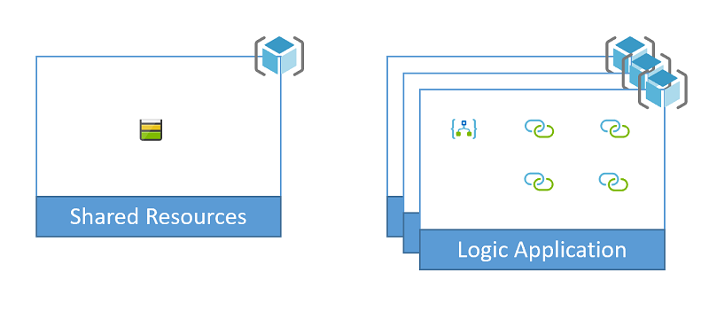

# Connecting to Storage Accounts from Microsoft Azure Logic Apps

This sample illustrates how to create the four different kinds of storage API connections: Blob, Table, Queue and File. The definition itself isn't very complex. The intention is to focus on how to create the API Connections that will be used by the definition. 

Review the [Sample File Definition](../file-definitions.md) documentation for a understanding of how these scripts function. 

This particular sample will use the output variables from the connectors-template.json

``` json
"outputs": {
    "tablesManagedApiId": {
      "type": "string",
      "value": "[variables('tablesConnectionId')]"
    },
    "tablesConnId": {
      "type": "string",
      "value": "[resourceId('Microsoft.Web/connections', variables('tablesConnectionName'))]"
    },
    "fileManagedApiId": {
      "type": "string",
      "value": "[variables('fileConnectionId')]"
    },
    "fileConnId": {
      "type": "string",
      "value": "[resourceId('Microsoft.Web/connections', variables('fileConnectionName'))]"
    },
    "blobManagedApiId": {
      "type": "string",
      "value": "[variables('blobConnectionId')]"
    },
    "blobConnId": {
      "type": "string",
      "value": "[resourceId('Microsoft.Web/connections', variables('blobConnectionName'))]"
    },
    "queuesManagedApiId": {
      "type": "string",
      "value": "[variables('queuesConnectionId')]"
    },
    "queuesConnId": {
      "type": "string",
      "value": "[resourceId('Microsoft.Web/connections', variables('queuesConnectionName'))]"
    },
    "logicAppName": {
      "type": "string",
      "value": "[variables('logicAppName')]"
    }
  }
```
> [!NOTE]
> Pay special attention to the different parameterValues for each of the storage connections. There is some inconsistency in how these managed APIS have been defined that often cause some confusion. The azurefile and azureblob APIs both want an accountname and accesskey while the azuretables and azurequeues want storageaccount and sharedkey.

To replace each one of the {token} values in the logic-app-definition-parameters.json and use the resulting value to update the logic app's definition.

``` json
{
    "$connections": {
        "value": {
            "azuretables": {
                "connectionId": "{tablesConnId}",
                "connectionName": "azuretables",
                "id": "{tablesManagedApiId}"
            },
            "azureblob": {
                "connectionId": "{blobConnId}",
                "connectionName": "azureblob",
                "id": "{blobManagedApiId}"
            },
            "azurefile": {
                "connectionId": "{fileConnId}",
                "connectionName": "azurefile",
                "id": "{fileManagedApiId}"
            },
            "azurequeues": {
                "connectionId": "{queuesConnId}",
                "connectionName": "azurequeues",
                "id": "{queuesManagedApiId}"
            }
        }
    }
}
```

## Prerequisites

- Install [Azure PowerShell 2.4.0](https://docs.microsoft.com/en-us/powershell/azure/install-az-ps?view=azps-2.4.0) on your platform

## Setup

The sample provides options for either running directly from a command line or configuring an Azure DevOps pipeline.

### Command line

To run this sample from the command line, follow these steps.

1. Clone or download this sample repository
2. Sign in to Azure from you're command line tool of choice
   
``` powershell
Connect-AzAccount
```

3. Select the appropriate [Azure context](https://docs.microsoft.com/en-us/powershell/module/az.accounts/Select-AzContext?view=azps-2.4.0) to target the deployment for

4. Run the following command from the context of the powershell directory of the sample to execute a full deployment to Azure

``` powershell
./full-deploy.ps1 -groupId <groupId> -environment <environment> -location <region name>
```

### Azure DevOps

This sample uses the [Multi-stage YAML pipelines](https://docs.microsoft.com/en-us/azure/devops/pipelines/process/stages?view=azure-devops&tabs=yaml). To setup the sample pipeline follow these steps.

1. Ensure the Multi-stage pipeline [preview feature](https://docs.microsoft.com/en-us/azure/devops/project/navigation/preview-features?view=azure-devops) is enabled. 
2. Clone or fork the samples repository into your own repository
3. Either:
   - Create an [Azure Resource Manager service connection](https://docs.microsoft.com/en-us/azure/devops/pipelines/library/service-endpoints?view=azure-devops&tabs=yaml#sep-azure-rm) named "Azure Samples Subscription" within your project that points to the Azure Subscription you wish to deploy to

   or

   - Edit all instances of `azureSubscription: 'Azure Samples Subscription'` within the ./powershell/azure-pipelines.yml file with the name of an existing Azure Resource Manager service connection within your project

> [!NOTE]
> The Azure Resource Manager service connection needs to either have the "Allow all pipelines to use this connection" checkbox checked, or you will need to authorize the pipeline you create in the next step to use the service connection.

4. Update the following ./pipeline/azure-pipelines.yml variables
   - groupId: with a value unique to you and/or your organization. All resources and resource groups created will start with this value
   - location: with the name of the region you would like to deploy the resources to
   - abbrevLocationName: with a shortened version of the location name that will used as part of the resource names
5. Create a new pipeline within your project that uses the ./powershell/azure-pipelines.yml from this sample
   


## Supporting documentation

The following documentation has been provided to help assist in understanding the different pieces of this sample.

- [Concepts](../concept-review.md): This will cover several of the defining concepts of this sample
- [Naming Conventions](../naming-convention.md): This will cover the naming conventions applied to the resources created as part of the sample. 
- [Sample File Definition](../file-definitions.md): This will describe the purpose of the different files within the sample.
- [Scaling](../api-connection-scale.md): This will cover the reason behind the instanceCount variable and why this sample has the ability to increase the number of copies of the logic apps that are deployed.

## Resources

This sample will create the following resources.



### Shared-template

The shared template will create a single storage account resource with two blob containers. The shared-deploy.ps1 will then add two sample queues, file shares and tables.

### Connectors-template

This template will an API connection resource for Azure Tables, Files, Blobs and Queues.

### Logic-app-template

This will create a shell of the logic app. The definition is blank to allow for the separation of resource template from the definition.

### Logic-app-definition

This has a very simple logic app definition that will pull a message from queue1, create a blob file from the message content, write an entity into the storage table and create a file in the file share.

## Clean up

To remove the resource groups created by the sample, run the following command from the context of the powershell directory of the sample.

``` powershell
./clean-up.ps1 -groupId <groupId>
```

This will delete all resource groups that have a name that starts with the groupId provided. 